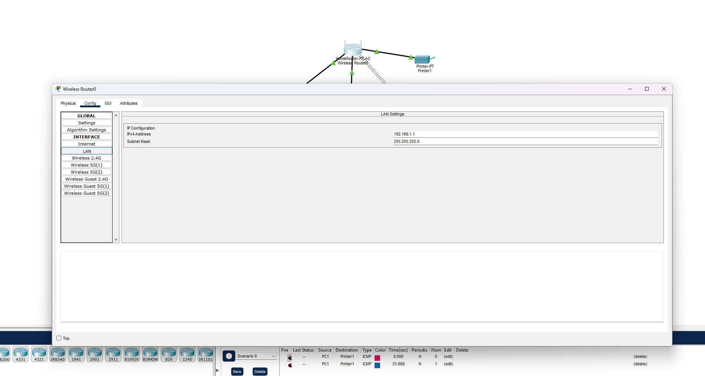

# home_lab_sim

# Home Network Overview & Troubleshooting Guide

Aditya Khanna

## 1. Purpose

Short overview of my simulated home network setup in Cisco Packet Tracer and connectivity testing performed for documentation practice.

## 2. Network Details

| Item | Value |
| --- | --- |
| WAN IP (public) | 101.119.145.21 |
| Router LAN IP | 192.168.1.1 |
| LAN IP range | 192.168.1.0/24 |
| DHCP range | 192.168.1.100 - 192.168.1.200 (static addressing used for the purposes of this project) |
| DNS server(s) | 1.1.1.1 |
| ISP | Vodafone AU |

PC1 has been used as the host system for the purposes of this project (as seen in diagrams below)



Fig.1 - Router LAN Configuration


Fig.2 - PC1 IP Configuration

## 3. Network Diagram


Fig.3 - Network Topology

## 4. Connectivity Testing

Ran these commands and noted the output.

Windows:

```
ping google.com
tracert google.com
```

Alternatively for Linux/macOS:

```
ping google.com
traceroute google.com
```

Record:
- Response times = 46ms Average
- Any packet loss = None
- Number of hops in traceroute = 20 hops including 8 timed out requests


Fig.4 - ping and tracert command outputs

## 5. Troubleshooting Steps Performed

1. Issue: Printer1 not being detected by other hosts on the network
Diagnosis: Pinged the printer to and from, checked the physical connections
Fix: Connections made by auto-connect in Cisco Packet Tracer were incompatible for borderline arbitrary reasons. Disconnected and reconnected all connections manually.
2. Issue: Smartphone1 and Router0 not connecting to each other
Diagnosis: Rechecked all connections and ports available on both devices, researched online
Fix: Was attempting to connect Smartphone through LAN which, while technically possible, was unideal, connected to Wireless 2.4GHz instead.

## 6. Reflection

This exercise showed how DHCP, DNS, and routing work together to get a device from "plugged in" to "connected".  While I used manual IP assignments, I found out how DHCP handles automatic IP assignment so devices don't need manual configuration, DNS translates domain names into reachable addresses, and traceroute exposes the actual path (and hop count) a packet takes to reach its destination. Troubleshooting the printer and phone connections also reinforced that most connectivity issues come down to physical/logical layer mismatches (wrong port type, wrong wireless band) rather than complex faults, which is exactly the kind of first-line diagnosis expected in an IT support role.
